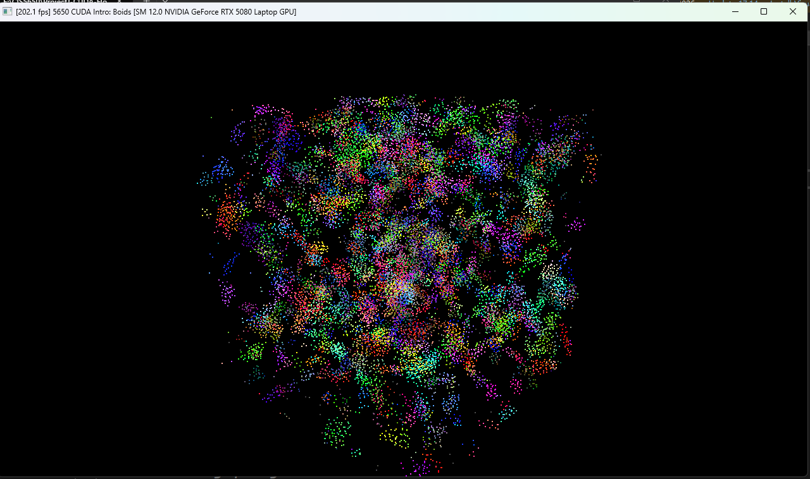
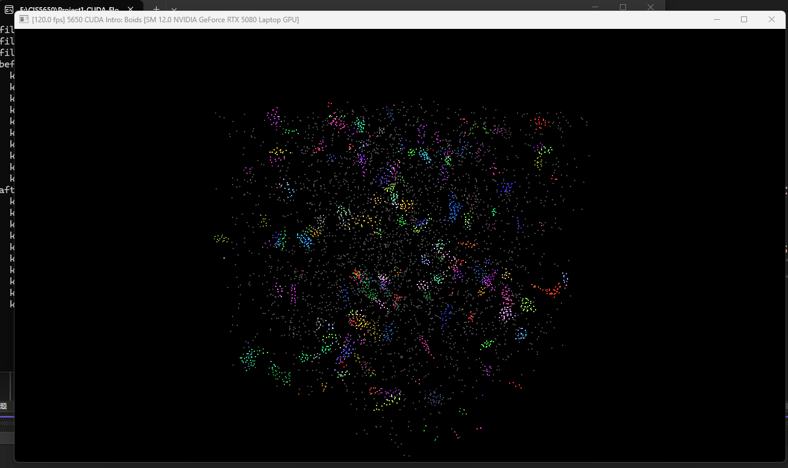
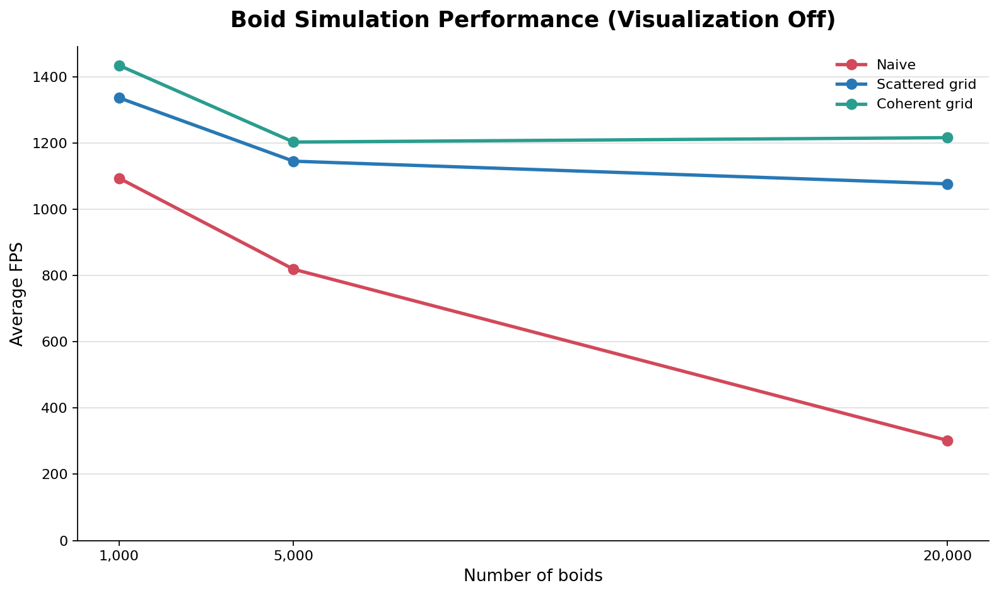
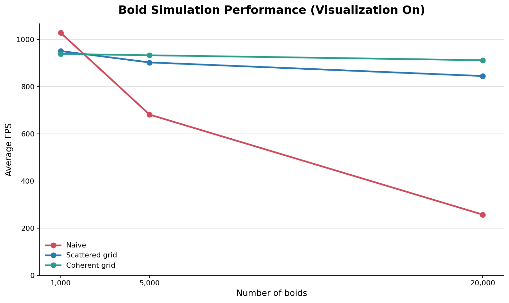
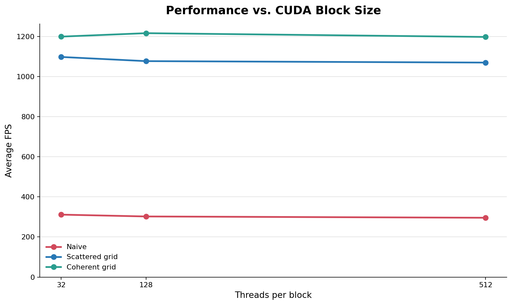

**University of Pennsylvania, CIS 5650: GPU Programming and Architecture,
Project 1 - Flocking**

* Yikai Li
* Tested on: Razer Blade 16 (RZ09-0528), Windows 11 Home 25H2 64-bit, AMD Ryzen AI 9 365 with Radeon 880M (10 cores), 32 GB LPDDR5-8000 RAM, NVIDIA GeForce RTX 5080 Laptop GPU 16 GB (Personal Computer)

## Overview

This project implements Reynolds-style boid flocking with CUDA using cohesion, separation, and alignment. It includes three neighbor-search methods:

- **Naive:** every boid checks every other boid.
- **Scattered grid:** boids are grouped by grid cell using sorted indices, but their position and velocity data remain scattered.
- **Coherent grid:** position and velocity data are reordered by grid cell for more contiguous memory access.

## Performance Analysis

### Methodology

- Release x64
- VSync and NVIDIA Max Frame Rate disabled
- Five FPS readings averaged per configuration
- Default block size: 128
- Time step: 0.2
- Fixed window size and camera

### Boid Count — Visualization Off

| Boids | Naive | Scattered | Coherent |
|---:|---:|---:|---:|
| 1,000 | 1093.8 | 1336.4 | 1434.2 |
| 5,000 | 819.0 | 1145.2 | 1203.0 |
| 20,000 | 302.2 | 1076.8 | 1216.2 |

Naive performance decreases sharply as the number of boids increases because its neighbor search is $O(N^2)$. The grid methods scale better because each boid only checks nearby cells instead of the entire array.

From 1,000 to 20,000 boids, Naive FPS decreased by 72.4%, compared with 19.4% for Scattered and 15.2% for Coherent.

### Boid Count — Visualization On

| Boids | Naive | Scattered | Coherent |
|---:|---:|---:|---:|
| 1,000 | 1028.0 | 950.8 | 938.8 |
| 5,000 | 681.4 | 902.6 | 933.0 |
| 20,000 | 257.2 | 845.0 | 912.0 |

Visualization reduces FPS because every frame also copies simulation data to graphics buffers and renders the particles. At 1,000 boids, grid construction costs more than it saves. At larger boid counts, both grid methods outperform Naive.

### Block Size

This test used 20,000 boids with visualization disabled.

| Block Size | Block Count | Naive | Scattered | Coherent |
|---:|---:|---:|---:|---:|
| 32 | 625 | 311.4 | 1097.6 | 1199.0 |
| 128 | 157 | 302.2 | 1076.8 | 1216.2 |
| 512 | 40 | 295.8 | 1069.6 | 1197.4 |

Block size had a relatively small effect compared with the neighbor-search algorithm. Naive and Scattered performed best at 32 threads, while Coherent performed best at 128. This likely reflects differences in occupancy, register use, and scheduling flexibility.

### Coherent vs. Scattered Grid

At 20,000 boids, Coherent reached 1216.2 FPS compared with 1076.8 FPS for Scattered:

$$
\frac{1216.2-1076.8}{1076.8}\times100\%
\approx12.9\%
$$

This improvement was expected because boids in the same cell are stored contiguously, improving memory locality and removing one level of indirection. However, Coherent also pays an additional cost to reorder position and velocity data each frame.

### 8-Cell vs. 27-Cell Search

This test used 20,000 boids, visualization disabled, and a block size of 128.

| Configuration | Average FPS |
|---|---:|
| 8 cells, width $2r$ | 1123.8 |
| 27 cells, width $r$ | 1224.2 |

The 27-cell version was approximately 8.9% faster. Although it checks more cells, those cells are smaller:

$$
8(2r)^3=64r^3,\qquad 27(r)^3=27r^3
$$

The smaller candidate volume reduced the number of boid distance checks enough to offset the additional cell accesses.

**CMake modifications:** None.
